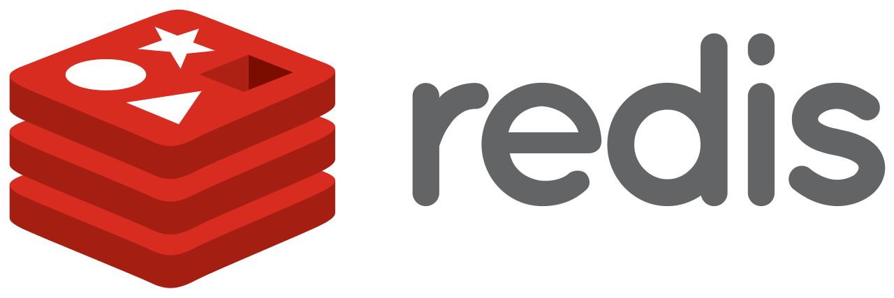
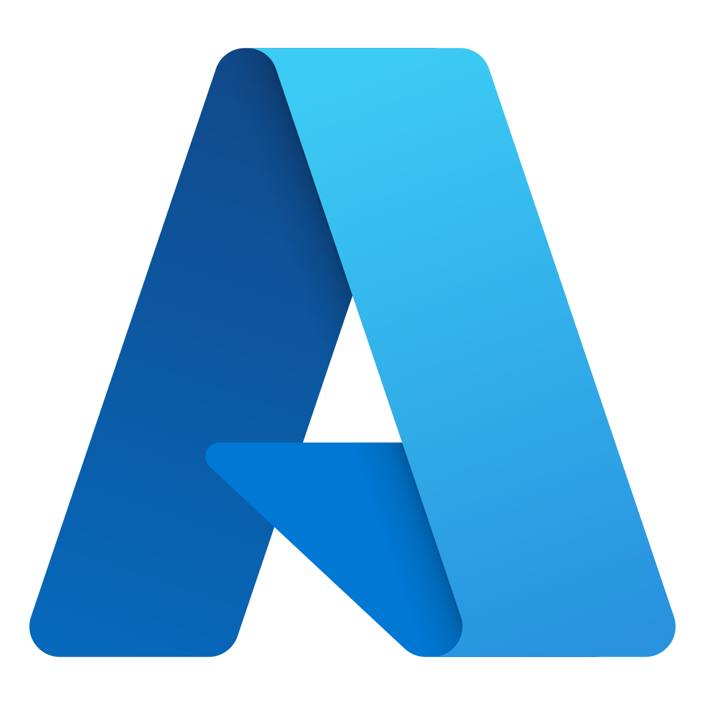
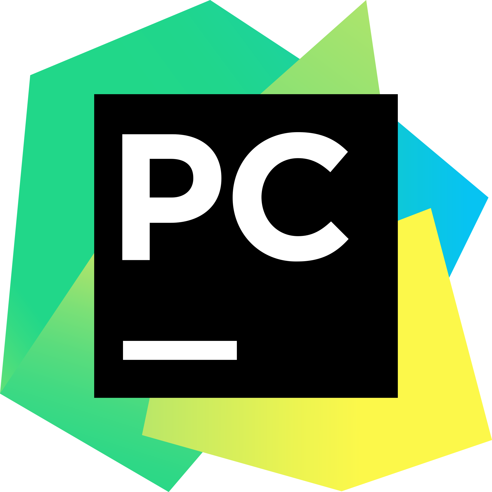

# hello stranger!

<h3>I am a freelance software/data engineer with ML & MLOps skills</h3>

 
 
 
 
 

---

  
<b>about me</b>

* 15+ years as a software engineer, and I keep on learning
* Expert in building backend, big data, and ML systems
* Built systems with Java, Scala, Python, Groovy, Kotlin
* Cloud experience with GCP, Azure, AWS, PCF and WMWare Tanzu
* Experienced in distributed computing (Hadoop, NoSQL, Spark, Kubernetes)
* Experienced in OOP, FP and TDD
* Experienced in Agile methodologies
* Comfortable with DevOps duties and occasional frontend development
* Can fulfill Lead or Senior Engineer roles
* MSc in Computer Science (2008) 
* BSc in Statistics (2004) 

My interests are (I spend time thinking about):
* Fact based decisions
* Data intensive applications
* Bringing ML models to production, MLOps and overall how we could improve tooling/practices around ML projects

Some values/perspectives I have:
* I am not religious or obsessed with any platform/language/tool. They are all good when used in the right context. I care about problems and domains. 
* For me people and organization culture are more important than tech & tools. 
* I am a fan of Richard Feynman. As a result I am against cargo cult science (or development)
* I get more satisfaction from deleting code rather than writing it. 

 

  
<b>skills/tools/platforms</b>

Over the years I used several programming languages, frameworks and tools. I only list the ones below that I recently use(d) 

**Programming Languages**:

&nbsp;
&nbsp;
&nbsp;

&nbsp;
&nbsp;

&nbsp;

 

**Big Data**:

&nbsp;
&nbsp;

&nbsp;
&nbsp;

&nbsp;
&nbsp;

&nbsp;
&nbsp;

**Data Science/ML**:

&nbsp;
&nbsp;

&nbsp;
&nbsp;

&nbsp;
&nbsp;

**Sql/NoSql**:

&nbsp;
&nbsp;

&nbsp;
&nbsp;

&nbsp;
&nbsp;

&nbsp;
&nbsp;

&nbsp;
&nbsp;

&nbsp;
&nbsp;
&nbsp;
&nbsp;
&nbsp;

**Platforms/Ops**:

&nbsp;
&nbsp;

&nbsp;
&nbsp;

&nbsp;
&nbsp;

&nbsp;
&nbsp;

**Frameworks**

&nbsp;
&nbsp;

**Daily**:

&nbsp;
&nbsp;

&nbsp;
&nbsp;

&nbsp;
&nbsp;

&nbsp;
&nbsp;

&nbsp;
&nbsp;

&nbsp;
&nbsp;

 

  
<b>what's here</b>

* [my projects](https://github.com/ozgunalan)
* [assignments](https://github.com/oalan-assignments): code I wrote for some take-home assignments
* [forks](https://github.com/oalan-forks): put them here away for some organization
* [learnings](https://github.com/oalan-learnings/): code & notes for followed courses and learning materials

<!--todo: [learning & notes]()-->
<!--todo: [posts]()-->

 

  
<b>how to reach me</b>

 

 

  
<b>before you leave</b>

 

> It is easy in the world to live after the world’s opinion; it is easy in solitude to live after our own; but the great man is he who in the midst of the crowd keeps with perfect sweetness the independence of solitude. — Ralph Waldo Emerson

<!---
ozgunalan/ozgunalan is a ✨ special ✨ repository because its `README.md` (this file) appears on your GitHub profile.
You can click the Preview link to take a look at your changes.
--->

<!--- Maybe later

- 👋 Hi, I’m @ozgunalan
- 👀 I’m interested in ...
- 🌱 I’m currently learning ...
- 💞️ I’m looking to collaborate on ...
- 📫 How to reach me ...
--->

 

