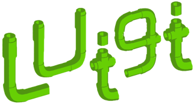

### hello stranger!

I am a contractor/freelance software engineer with big data, ML and MLOps experience</h3>

 
 
 
 
 

---

  
<b>about me</b>

I am experienced in designing and building backend, big data and machine learning (ML) solutions

I have been professionally developing software since 2007. I hold a BSc in Statistics and MSc in Computer Science

I have built systems using Java, Scala, Groovy, Kotlin, and Python. I am experienced in object-oriented programming, functional programming, test-driven development, multi-paradigm languages

I have hands on experience in distributed computing environments and computing at scale (e.g. hadoop, nosql, cloud computing). I completed projects using AWS, GCP, Azure and PCF. I am comfortable with DevOps activities

I can fulfil roles of Senior Engineer or Tech Lead within a team/organization

I am a lifelong learner. I enjoy sharing my knowledge and mentoring

My interests are (I spend time thinking about):
* Fact based decisions
* Data intensive applications
* Bringing ML models to production, MLOps and overall how we could improve tooling/practices around ML projects

Some values/perspectives I have:
* I am not religious or obsessed about any platform/language/tool. They are all good when used in the right context. I care about problems and domains. 
* For me people and organization culture are more important than tech & tools. 
* I am a fan of Richard Feynman. As a result I am against cargo cult science (or development)
* I get more satisfaction by deleting code rather than writing it. 

Then you may ask why are you here at all? Well... 

 

  
<b>skills/tools/platforms</b>

Over the years I used several programming languages, frameworks and tools. I only list the ones below that I recently use(d) 

**Programming Languages**:

&nbsp;

&nbsp;
&nbsp;
&nbsp;

&nbsp;
&nbsp;

&nbsp;

 

**Big Data**:

&nbsp;
&nbsp;

&nbsp;
&nbsp;

&nbsp;
&nbsp;

&nbsp;
&nbsp;

**Data Science/ML**:

&nbsp;
&nbsp;

&nbsp;
&nbsp;

&nbsp;
&nbsp;

**Sql/NoSql**:

&nbsp;
&nbsp;

&nbsp;
&nbsp;

&nbsp;
&nbsp;

* Redis
* Cassandra
* Clickhouse

**Platforms/Ops**:

* Azure
* GCP
* Kubernetes
* Docker
* Bamboo
* Jenkins

**Daily**:

* Idea
* Vim
* Git
* ipython
* zsh
* Linux

 

  
<b>what's here</b>

* [my projects](https://github.com/ozgunalan)
* [assignments](https://github.com/oalan-assignments): code I wrote for some take-home assignments
* [forks](https://github.com/oalan-forks): put them here away for some organization

<!--todo: [learning & notes]()-->
<!--todo: [posts]()-->

 

  
<b>how to reach me</b>

 

  
<b>before you leave</b>

> It is easy in the world to live after the world’s opinion; it is easy in solitude to live after our own; but the great man is he who in the midst of the crowd keeps with perfect sweetness the independence of solitude. — Ralph Waldo Emerson

<!---
ozgunalan/ozgunalan is a ✨ special ✨ repository because its `README.md` (this file) appears on your GitHub profile.
You can click the Preview link to take a look at your changes.
--->

<!--- Maybe later
https://c.tenor.com/vRhSpkeqingAAAAC/gothguy-it-crowd.gif
https://c.tenor.com/FpMv-YlXlS4AAAAd/the-it-crowd-huh.gif

- 👋 Hi, I’m @ozgunalan
- 👀 I’m interested in ...
- 🌱 I’m currently learning ...
- 💞️ I’m looking to collaborate on ...
- 📫 How to reach me ...
--->

 

